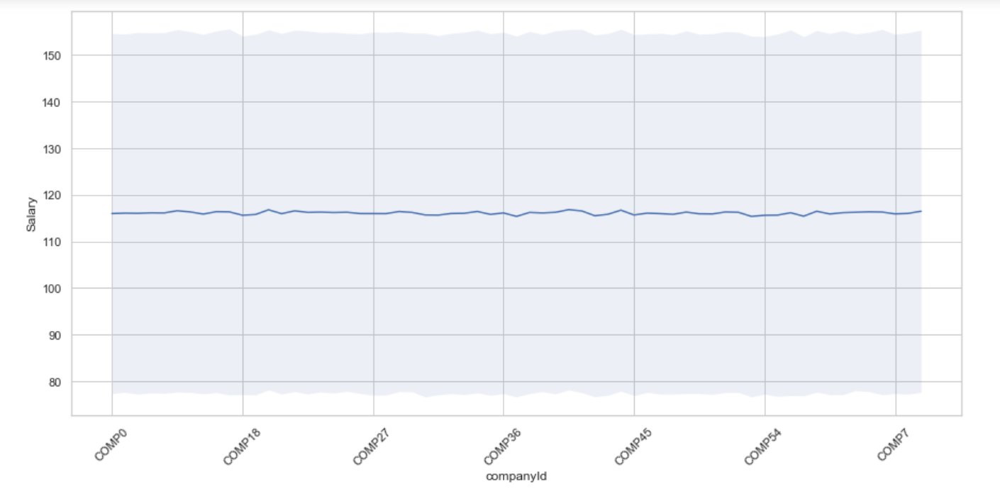

# Salary Prediction Project

# Introduction
Salary structures are a necessary part of effective management. They help make sure that the pay levels are externally competitive and internally fair. Salary structures also allow companies to reward performance and development while controlling cost.

The goal of this project is to help companies to set up a legitimate salary structure based on a set of job postings with salaries.

# Supplied Data
- train_features.csv: Each row represents is an individual record of job posting. Each column describes features of the job posting.
- train_salaries.csv: Each row associates a “jobId” with a “salary”.
- test_features.csv: Similar to train_features.csv, but used for our ultimate prediction.

# Data Exploration
1. Import useful libraries and load the dataset.
2. Take a rough look at the three data. Each of them has one million records and mixed data types(numerical+categorical).
3. Data Cleaning
   - There are no missing or duplicated values in the data.
   - Check and inspect potential outliers based on IQR rule and remove five records of data with salary zero.
   
# Explanatory Data Analysis
In this section, I just plotted each variable against salary to observe if there is any relationship between variables.
 
