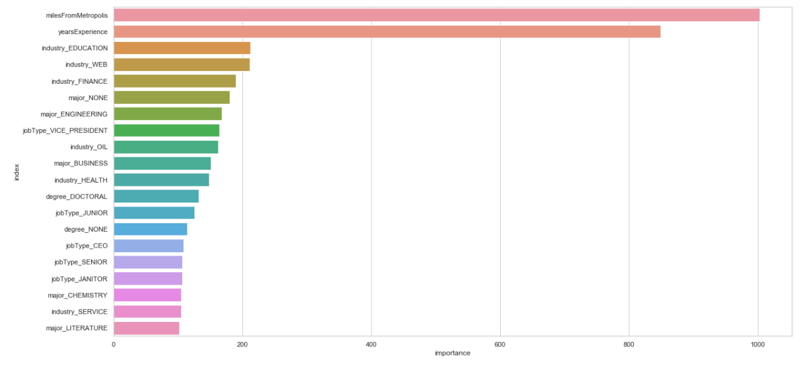

# Salary Prediction Project

# Introduction
Salary structures are a necessary part of effective management. They help make sure that the pay levels are externally competitive and internally fair. Salary structures also allow companies to reward performance and development while controlling cost.

The goal of this project is to help companies to set up a legitimate salary structure based on a set of job postings with salaries.

# Supplied Data
- train_features.csv: Each row represents is an individual record of job posting. Each column describes features of the job posting.
- train_salaries.csv: Each row associates a “jobId” with a “salary”.
- test_features.csv: Similar to train_features.csv, but used for our ultimate prediction.

# Data Exploration
1. Import useful libraries and load the dataset.
2. Take a rough look at the three data. Each of them has one million records and mixed data types(numerical+categorical).
3. Data Cleaning
   - There are no missing or duplicated values in the data.
   - Check and inspect potential outliers based on IQR rule and remove five records of data with salary zero.
   
# Explanatory Data Analysis
In this section, I just plotted each variable against salary to observe if there is any relationship between variables.
      
         
        

From the above plots, we are able to observe that salary seems independent with different companies and dependent with other ingredients.
- There is a clear positive correlation between job type and salary. In general, CEO tends to have the highest salary.
- Advanced degrees tend to have higher salaries.
- People with math, business and engineering background tend to earn more.
- Web, finance and oil seem to pay better.
- Salary increase with increasing experience and decrease with increasing miles from metro area.

I also conducted a correlation analysis between variables. To make categorical variables stand out, I encode the categories using average salary for each category to replace label and then calculated the correaltion between variables. As a result, a heatmap comes up and we can clealy visualize the rlations.

We can see that job type is most correlated with salary, followed by degree, major and years of experience. Among the features, we find that degree and major have a strong correlation and jobtype has a moderate degree of correlation with both degree and major.

# Baseline Establishment
According to our EDA, jobtype seems most relevant to salary. So we just set up a baseline model which calculates average salary for each job type and conduct 5-fold corss-validation. The MSE value turns out to be 963.93. Later I will work on finding other models with a lower MSE level.

# Hypothetical Solutions:
In terms of regression, I believe the following three should be good candidates:
- Linear Regression:The simplest model sometimes yields the best results. From our EDA, we observe some linear relations, so this model should be a good candidate.
- Random Forest Regression: A Random Forest is a method of ensemble learning which consists in growing several decision trees in parallel and combining their output to make a prediction. In our case, this model will fairly use all of our features.
- Gradient Boosting Regression: Gradient Boosting tries to solve an optimization problem: its goal is to reduce a loss function by adding a weak learner at each step. Here we use XGBoosting for more time efficiency.

# Model Development
## Feature engineering
 apply one-hot encoding to all categorical columns and drop jobid which is unique for every record.
## Create models
 all models are created in this section. Hyperparameter tuning has been done through randomizedserchCV and gridSearchCV for Random Forest and XGBoost models.
## Test models
Test each model by 5-fold corss-valiadation and return the metric mse for each model.

| Model             | MSE           | 
| ----------------- |:-------------:| 
| Linear Regression  | 384.35 | 
| Linear Regression after standardization and dimention reduction | 384.49| 
| Random Forest | 378.53 |   
| XGBoost|355.88|

# Model Selection
XGBoost yields the lowest mse so it is selected to be our best model to predict the test dataset.

# Model Deployment
- Train our best model XGBoost on the entire trainning data.
- Transform the test data in the same way as the previous training data.
- Deploy the model on test data to predict salaries.
- Derive feature importance generated by the model.

As we can see above, the distance from metro area and level of experience play the most important roles on salary. Additionally, education, web and finance industry seem to affect salary in some degree. These factors should be considered for future salary level setting.
- Combine the original test data with the predicted salaries and export to csv as a deliverable.
- Save the model and export feature importance data to csv file.
